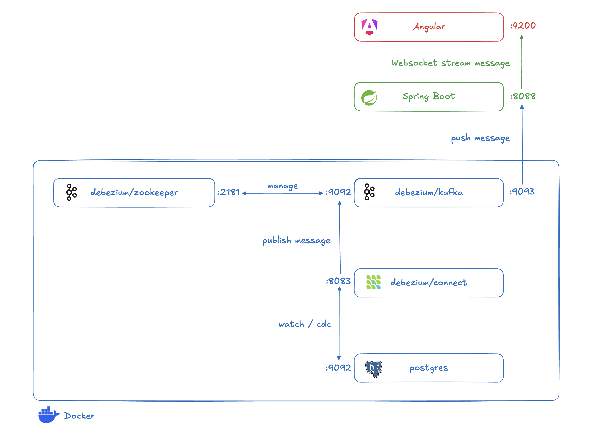
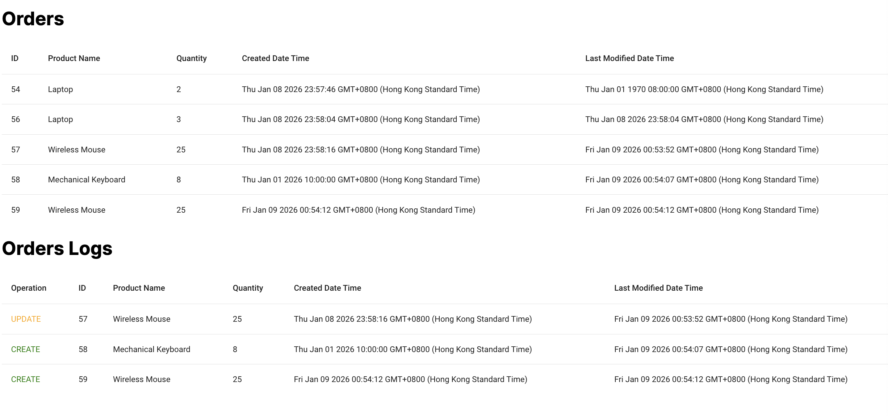

# Debezium CDC Kafka

This project aims to test out how to integrate CDC, Kafka and Spring Boot all together.



We all have experienced where we wanted to keep track of the changes in the database, but polling doesn't sound right, it is wasting resources and ineffecient. Change Data Capture is the solution, where changes from the database is picked up and published to the MQ for the services to further process the changes.

The following project simulate a simple ordering system, any `create`, `update`, `delete` of records will be captured by `Debezium` and published to `Kafka`.

`Orders` is showing the latest orders
`Orders Logs` is showing the history of changes in the database table



## Demo

The following video shows how the changes in database is monitored by Debezium, published to Kafka, pushed to Spring Boot, and finally streamed to Angular via Websocket


## Docker container services and ports

| Service / Image        | Port                                                | Description                                                         |
| ---------------------- | --------------------------------------------------- | ------------------------------------------------------------------- |
| debezium/zookeeper:2.5 | 2181, 2888, 3888                                    | Standard Zookeeper tailored for Debezium/Kafka setups               |
| debezium/kafka:2.5     | 9092 (for inside docker), 9093 (for outside docker) | Apache Kafka image customized for Debezium workflows                |
| debezium/connect:2.5   | 8083                                                | Kafka Connect base pre-loaded with all official Debezium connectors |
| postgres:15            | 5432                                                | Database                                                            |

## Local machine services and ports

| Service     | Port |
| ----------- | ---- |
| Spring Boot | 8088 |
| Angular     | 4200 |

# Set Up

### Step 1

Go to `backend` directory

```bash
cd backend
```

Start Docker container

```bash
docker-compose up -d
```

### Step 2

Insert data to database

```bash
# Enter the postgres container
docker-compose exec postgres psql -U postgres -d inventory

# (Inside the SQL prompt)
CREATE TABLE "order" (id SERIAL PRIMARY KEY, product_name VARCHAR(100), quantity int, created_datetime TIMCESTAMPTZ DEFAULT CURRENT_TIMESTAMP, last_modified_datetime TIMESTAMPTZ DEFAULT CURRENT_TIMESTAMP);
INSERT INTO "order" (product_name, quantity, last_modified_datetime) VALUES ('Laptop', 2, NULL);
INSERT INTO "order" (product_name, quantity, last_modified_datetime) VALUES ('Smartphone', 5, NULL);

# Exit psql
\q
```

### Step 3

Send a JSON configuration to Debezium to watch Postgres `order` table

```bash
curl -i -X POST -H "Accept:application/json" -H "Content-Type:application/json" http://localhost:8083/connectors/ -d '{
  "name": "order-connector",
  "config": {
    "connector.class": "io.debezium.connector.postgresql.PostgresConnector",
    "database.hostname": "postgres",
    "database.port": "5432",
    "database.user": "postgres",
    "database.password": "postgres",
    "database.dbname": "inventory",
    "topic.prefix": "dbserver1",
    "table.include.list": "public.order",
    "plugin.name": "pgoutput"
  }
}'
```

### Step 4

Watch topic `dbserver1.public.order`

```bash
docker-compose exec kafka /kafka/bin/kafka-console-consumer.sh \
    --bootstrap-server kafka:9092 \
    --from-beginning \
    --property print.key=true \
    --topic dbserver1.public.order
```

### Step 5

To monitor the last modified time of any changed data, add db trigger for `last_modified_datetime`

```postgresql
CREATE OR REPLACE FUNCTION update_last_modified_datetime()
RETURNS TRIGGER AS $$
BEGIN
    NEW.last_modified_datetime = CURRENT_TIMESTAMP;
    RETURN NEW;
END;
$$ LANGUAGE plpgsql;

CREATE TRIGGER trigger_update_last_modified
BEFORE UPDATE ON "order"
FOR EACH ROW
EXECUTE FUNCTION update_last_modified_datetime();
```

### Step 6

Start `Spring Boot` backend service

```bash
./mvnw spring-boot:run
```

### Step 7

Start `Angular` frontend client

```bash
cd ../frontend
```

```bash
ng serve
```

### Step 8

To trigger the CDC, copy any SQL command from `/backend/src/main/resources/data.sql` and execute the SQL

```bash
# Enter the postgres container
docker-compose exec postgres psql -U postgres -d inventory

# <Insert SQL command here>
```

## Appendix

### Delete Debezium connector

```bash
curl -X DELETE http://localhost:8083/connectors/order-connector
```

### See all kafka topics

```bash
docker-compose exec kafka /kafka/bin/kafka-topics.sh --list --bootstrap-server kafka:9092
```

References:

1. https://medium.com/yazilim-vip/cdc-with-debezium-kafka-spring-boot-3-and-postgres-a523d5237cca
2. https://medium.com/@htyesilyurt/spring-boot-debezium-for-change-data-capture-cdc-kafka-mysql-redis-cacheable-all-in-one-708ef5298cba
3. https://docs.spring.io/spring-integration/reference/debezium.html
4. https://debezium.io/documentation/reference/stable/tutorial.html
5. https://debezium.io/documentation/reference/stable/integrations/serdes.html
